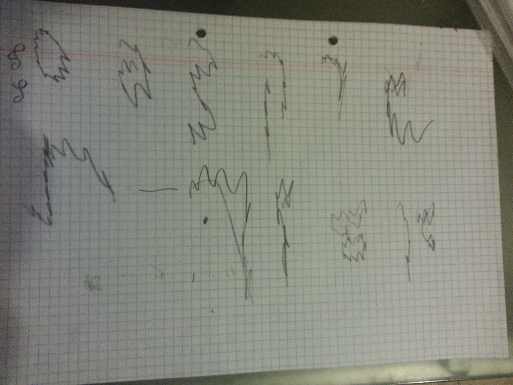

אותיות בזיגזג
========

פונט שאילאיל (5½) עיצבה. [פוסט ב„מילים דיגיטליות”](http://digitalwords.net/zigzagim).

שלבי התהליך:
* רעיון בראש של אילאיל.
* להבין עם אבא יודה שאפשר לעשות פונט ממוחשב.
* לצייר את האותיות על דף (במבט לאחור התברר שזה רעיון רע לצייר בעפרון על דף משובץ: קשה להפריד אחר־כך את האותיות מהמשבצות…).
* לצלם ולהעביר למחשב.
* לגזור את האותיות ב־[GIMP](http://gimp.org/), להעביר לשחור־לבן ולמחוק ארטיפקטים.
* לווקטר בעזרת [Potrace](http://potrace.sourceforge.net/).
* לייבא ל־[FontForge](http://fontforge.github.io/) ולסדר ריווח (ל־[kerning](http://designwithfontforge.com/en-US/Spacing_Metrics_and_Kerning.html) עדיין לא הגענו… ☺).
* לייצא.
* לשחק עם הפונט בעורך טקסט, לשמוח מלראות את האותיות שהיו במחשבה הופכות למשהו שאפשר ממש לכתוב בעזרתו, ולהתרגש מכל העניין.

טוב מראה עיניים:

האותיות א׳–פ׳

האותיות ס׳–ת׳ + סופיות

מאל״ף עד ת״ו

אני   אואבת   את   אמא
